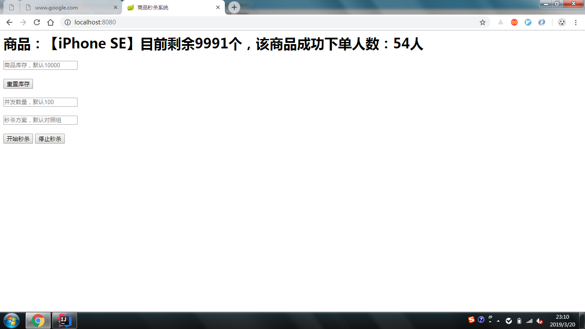

# seckill
用尽可能多的方式解决高并发秒杀系统中的超卖问题

## 一、超卖问题回溯
仔细想来，高并发情况下的秒杀超卖问题的表现形式有多种：库存扣减为负数、下单人数与库存扣减数不一致等。实际上这些表现形式都可以归因于不可重复读，亦即在**一个事务内部读取到的库存值会有变化**。先来看看在发生超卖问题时我们的秒杀流程：

1. 查询原有库存：oldQuantity = `select product_quantity from product where product_id=1;`
2. 判断oldQuantity > 扣减数num 
3. 生成订单
4. 扣减库存：`update product set product_quantity=product_quantity(或者oldQuantity)-num where id=1;`

## 二、方案

### 概述
- 初始条件：默认商品数量10000，秒杀成功人数0，并发线程数100
- 使用`CountDownLatch`实现模拟同时并发请求
- 为了简化数据库设计，使用`AtomicLong`模拟数据库中记录秒杀成功人数，但同时由于"递增该变量+执行sql语句”这组操作是非原子性的，会引发查询误差问题，但不影响数据最终一致性。

### 对照组：select+update发生超卖问题

### 方案A：使用`synchronized`或`Serializable`隔离级别的事务串行化执行

### 方案B：使用`Read-Commited`以上隔离级别的事务+库存限制+回滚
`update product set product_quantity=product_quantity-num where product_quantity >= num and product_id=1;`
这个方案可以保证不会发生超卖问题：如果`update`操作返回的行数为0，那么抛出`RuntimeException`异常，回滚取消订单即可。由于是`Read-Commited`级别的事务，回滚并不会导致脏读。
但是实际操作中少见该方案，我的一个猜测是并发高时冲突率过高，回滚严重性能下降。目前还未去验证这个猜测正确与否。

### 方案C：使用`CAS`乐观锁

### 方案D：使用事务+排他锁(`for update`)
1. start事务
2. 查询库存，并显式地设置写锁（排他锁）：oldQuantity = `select product_quantity from product where product_id=1 for update;`
3. 生成订单
4. 去库存，隐式地设置写锁（排他锁）：`update product set product_quantity=product_quantity-num where id=1;`
5. commit事务，释放锁

### 方案E：使用redis分布式锁
- 注意事项：
    - 需要设置超时避免死锁
    - 非强一致性，极端情况下锁会过期而数据库操作未完成
    
### 方案F：使用ZooKeeper分布式锁
- 优点：
    - 强一致性

### 方案G：使用redis队列

### 方案H：使用redis确认+消息队列异步扣减

### others：修改数据库源码、`Group commit`.....
参考[秒杀场景下MySQL的低效--原因和改进](https://wenku.baidu.com/view/128b76190722192e4536f6de.html)

## 三、TODO
- 日志
- 统一异常处理 
- 压测

## 四、参考
1. [秒杀怎么样才可以防止超卖？基于mysql的事务和锁实现](https://www.cnblogs.com/skying555/p/8661223.html)
